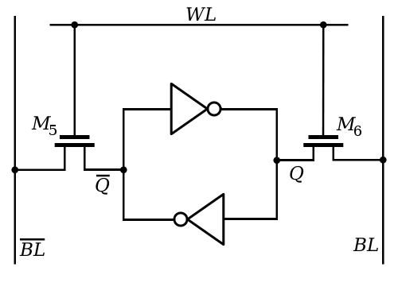
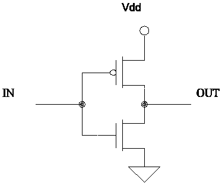
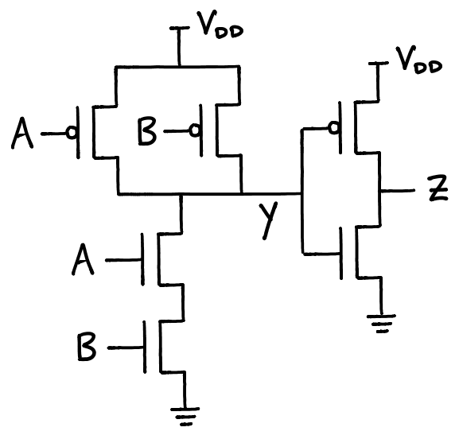

import ImageCredit from "../../components/generic/ImageCredit.astro";

# Prologue

Computers are the miracle of the modern age, and have transformed the way we
work, think, and live. To most, computers are magical and 'just work', a
sentiment derived from the boundless effort spent developing wonderful machines
and software by computer engineers and scientists.

Computer scientists are magicians in their own right, but modern software has
become so involved that they work at a much higher level than the hardware they
run their programs on. That is the domain of computer engineering, and a sort of
'final frontier' in understanding from top-to-bottom how a computer works.

Note that computer engineers don't know 'more' than computer scientists about
computers, they simply know how the hardware works instead of the software.
Computer Scientists get higher pay, so maybe they know 'more' than us engineers
about how to pick a concentration.

This post aims to explain top-down how a CPU design works, using a trivial CPU
as an example. Modern processors are orders of magnitude more complicated, but
that is way outside the scope of a casual understanding. Besides, us Computer
Engineers need to keep some trade secrets to ourselves, right?

I'm sorry if the title of this post is any cause for offense, if you're
interested in learning how the magic of how a CPU operates I'm certain you
aren't a dummy. It's a reference to the famous X-for-dummies book series.

# Binary Logic

## Why Binary?

Computer engineers very early on decided to use a binary number system with two
values, 0 and 1, as it made designing computer circuits orders of magnitudes
easier than any other system.

Designing a system that uses more values, such as a tertiary system with the
values 0, 1, and 2 would be incredibly difficult given the mechanics of how
circuits operate.

## Numbers in Binary

Don't fret, numbers greater than 1 can be represented in a binary system! Just
like how humans use the digits between 0 and 9 to represent values greater
than 9, computers use the _bits_ 0 and 1 to represent values grater than 1.

In human maths, we have the 1's place, 10's place, 100's place, and so on from
right to left. These 'places' are multiples of 10, and (suspiciously) we have
ten numbers in our number system. Our ten values mean we have a _base 10_ number
system, and our written numbers are composed of powers of 10.

Binary has two values and therefore is a _base 2_ number system, and it's
written numbers are composed of powers of 2. So, it has the 1's place, 2's
place, 4's place, 8's place, and so on. This is easier to understand visually:

  <ImageCredit
    author="unknown"
    url="https://sites.google.com/site/syhsdominguez/_/rsrc/1452718673850/creative-projects/binary-numbers/"
  />

While you don't need to be able to see 10010101 and intuitively know what human
number it is, it's important to understand that binary is more than capable of
representing a larger-than-one value.

## A note to Electrical Engineers

  <ImageCredit
    author="A.Sanysi Rao"
    url="https://www.slideshare.net/AllankiRao/digital-communications-18001485"
  />

Unlike analog electronics which operate on continuous values, computer circuits
operate on discrete values. This is necessary to avoid data corruption from
noise in a circuit (noise is unwanted electrical signal, like unwanted
background noise in a conversation).

Of all the possible discrete value number systems, a binary number system has
the widest noise margin (gap between values) and is therefore the safest from
electrical noise.

# What's in the Box?

## Von-Neumann Architecture

  <ImageCredit
    author="Computer Science GCSE GURU"
    url="https://www.computerscience.gcse.guru/theory/von-neumann-architecture"
  />

The Von-Neumann Architecture is a model for how computers look at a high level,
with the CPU containing a Control Unit and ALU (Arithmetic Logic Unit) that
are connected to a Memory Unit. The interaction of these blocks and the very
basics of how they are implemented are the crux of this post.

Programs are stored in binary as instructions, and the control logic of the CPU
reads in the program instruction by instruction and executes it. Instructions
either operate upon data or control the control flow of the processor. Both
operate using _registers_, special on-CPU memory that is very fast and used like
a scratchpad. _Data_ in memory needs to first be loaded into registers before
it can be operated on.

The Input and Output blocks model any devices attached to the processor. A PC
could be thought of having a Keyboard + Mouse input and Screen + Speaker output,
while an airplane autopilot controller has thousands of sensor inputs and the
planes physical controls as output.

## Assembly Code

  <ImageCredit
    author="unknown"
    url="https://stackoverflow.com/questions/6929440/what-does-func-means-in-r-format-instruction-set"
  />

Instructions are stored in machine code, typically in 32-bit sections called
_words_ (in 64-bit machines, words are 64 bits). As shown in the above graphic
the instruction is composed of several smaller bit-length values, which are
used to encode what the instruction is for interpretation by the processor.

## The Processor

  <ImageCredit
    author="unknown"
    url="http://inst.eecs.berkeley.edu/~cs61cl/fa08/labs/lab20.html"
  />

The control and data logic for a simple processor is laid out above. Control is
blue, data is black.

The control logic handles reading instructions from memory, and decoding each
instruction to appropriately control the passage of data through the processor.
It's also responsible for handling control-flow instructions, mainly conditions
and jumps.

Once an instruction is loaded, the control signals set the addresses the
register block should read from, what operation the ALU should perform, and
where the result should be written back to memory. The logic of how these are
implemented is complicated beyond the scope of this post, but can be found

<a href="http://minnie.tuhs.org/CompArch/Tutes/week02.html"> here</a>.

# Memory

## SRAM

  <ImageCredit
    author="Inductiveload"
    url="https://commons.wikimedia.org/wiki/File:SRAM_Cell_Inverter_Loop.png"
  />

On chip registers and caches are built using two inverters feeding back into
each other, which keeps a steady state. The two inverters are each built with
two transistors, leaving one SRAM bit costing 6 transistors.

## DRAM

  <ImageCredit
    author="Tosaka"
    url="https://commons.wikimedia.org/wiki/File:DRAM_Cell_Structure_(Model_of_Single_Circuit_Cell).PNG"
  />

Memory cells in DRAM are built with one transistor and one capacitor, which
stores a high or low value. The transistor is cutoff until the word line has a
high voltage on it, at which point the stored voltage flows out into the bit
line.

DRAM technology is slower than SRAM, and therefore makes little sense to put on
the CPU. It makes more sense to make DRAM storage massive, and put it on a
dedicated memory card. A conversation on the possibility of on-chip DRAM can be
found <a href="http://www.zdnet.com/article/why-doesnt-intel-put-dram-on-the-cpu/"> here</a>.

# Storage

## Hard Drives

  <ImageCredit
    author="PC Quest"
    url="http://www.pcquest.com/recovering-data-from-an-encrypted-hard-disk-on-ubuntu-14-04/"
  />

Hard drives store and load data from small magnetic wells on magnetic disks,
similar to how CDs and magnetic tapes are used in other media. Because the data
is stored by changing the magnetic state of the disk, data is stored even when
the disk isn't actively powered.

Keeping spinning disks in a portable device like a laptop is a bit dicey.
Luckily, drives with no moving parts exist.

## Solid State Drives

  <ImageCredit
    author="Harald Wehnar"
    url="https://en.wikipedia.org/wiki/Flash_memory#/media/File:Flash-Programming.svg"
  />

Solid state drives have no moving parts, and use flash gates like those above to
store data by holding some permanent electric field in the floating gate. The
gate is sandwiched with insulating silicon oxide, so it's charge state doesn't
change when the drive is powered off.

This form of storage is much faster than a hard drive, in part because there
aren't mechanical components to wait on. Also, flash memory can be incorporated
directly into a circuit, which allows tighter integration of storage and
circuitry.

# Implementing Logic Gates

## Shrinking Computers

Digital logic can be implemented by any electrical device that exhibits a
'switching' behavior, meaning it can toggle between transmitting a signal and
disconnecting that signal. In modern technology, transistors smaller than the
mind can comprehend are laid out by the billions on single chips, but that
development is a new one.

  <ImageCredit
    author="unknown"
    url="http://inst.eecs.berkeley.edu/~cs61cl/fa08/labs/lab20.html"
  />

Vacuum Tube and Transistor. Note the physical transistor is smaller than it's
packaging makes it seem.

Far far back, in the beginning times, computers were built with vacuum tubes,
the best switching device available at the time. Vacuum tubes were good at the
time, but they were big, fragile, and had a heated element in them that burned
tons of power.

Around the 1950's, semiconductor technology was developed, and the first
transistors were created. These transistors were much smaller than the vacuum
tubes they replaced and required no heating element, allowing transistors to be
packed more densely in designs.

  Billions of transistors in a modern intel CPU.
  <ImageCredit
    author="Gamer Nexus"
    url="https://www.gamersnexus.net/guides/833-reading-a-cpu-die"
  />

Over the years, designers discovered that transistor sizes were consistently
decreasing year-to-year, and that they could integrate multiple transistors on
a single sheet of silicon. Not long after, the first single-chip CPUs were
manufactured.

Nowadays, a single chip contains billions of transistors, and drastically
outpaces the massive warehouse-scale computers of yore.

To drive home the scale of the improvements made,

<a href="https://en.wikipedia.org/wiki/ENIAC">ENIAC</a> weighed 30 tons, took up
1,800 square feet of space, and had 20,000 vacuum tubes. Using a modern 14nm
manufacturing process
<a href="https://www.quora.com/What-is-the-average-transistor-count-per-unit-area-of-chips-produced-by-current-merchant-foundries">
  4.4 billion transistors can be fit into a square centimeter
</a>
. Conservatively assuming we'll need 10x the transistors to implement the same
logic the tubes did, a transistor-based ENIAC could fit into a 20th of a square
centimeter.

## CMOS Logic

Complementary Metal-Oxide Semiconductor technology is used to implement logical
gates in computers. The technology uses a PMOS-NMOS pair of transistors to
connect the output to the high or low voltage. Only one transistor of the pair
will be 'switched' on for any given input, which effectively means no current
flows in a CMOS technology.

  <ImageCredit
    author="Umang Solanki"
    url="https://www.quora.com/What-is-the-working-principle-of-CMOS-inverter"
  />

The above CMOS inverter produces an output of 1 for an input of 0, and output of
0 for and input of 1. This is because when the input is low, the PMOS (upper)
transistor conducts and the NMOS (lower) transistor is an open circuit,
connecting the output to the supply voltage. The opposite occurs for a high
input.

  <ImageCredit
    author="University of Illinois Urbana-Champaign"
    url="https://courses.engr.illinois.edu/ece110/fa2017/content/courseNotes/files/?logicAndCMOS"
  />

The above circuits are more complex CMOS circuits, which are less easily
understood. Further reading on them can be found

<a href="https://courses.engr.illinois.edu/ece110/fa2017/content/courseNotes/files/?logicAndCMOS">
  here
</a>

# Further Reading

<a href="http://www.quadibloc.com/comp/cp01.htm">
  A similar article to this, more focused on logic gates and older forms of
  memory.
</a>
